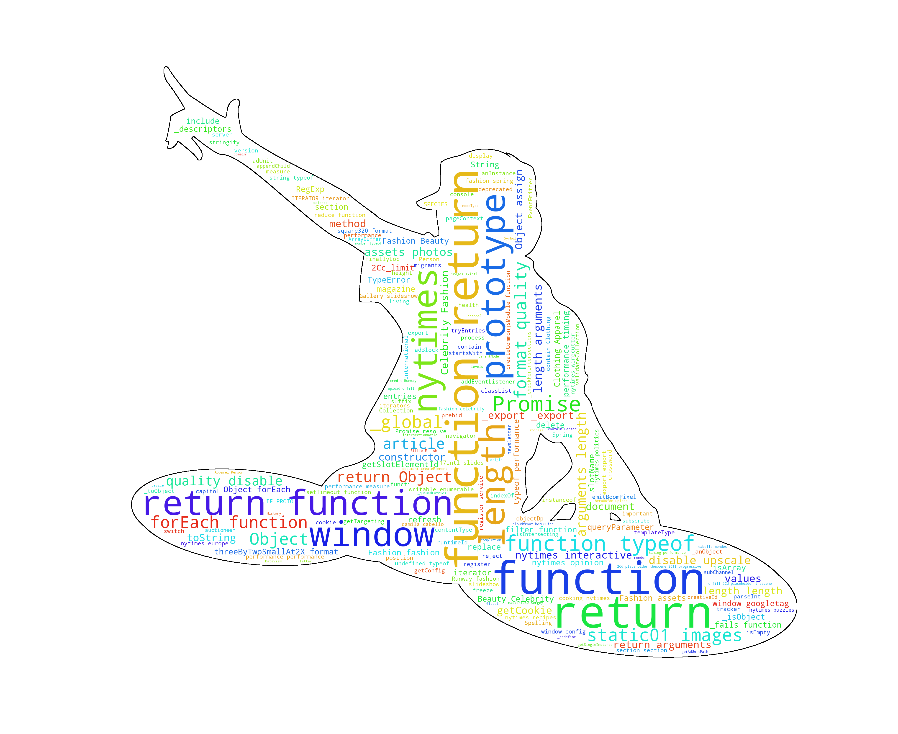

# trgn_wordcloud2
# TRGN_WORDCLOUD

## About the assignment

In this assignment, I would summarize 2 webpages to translate them into readble words by html2text and use these wordcloud. And I will put it on my website and  update it at 9:00 A.M. everyday.


## Installation

Use  `git clone`  to clone the repository from github to local sever.

* *html2text* should be installed to convert html files to readable text files. Below is the install code.

```
cd ~/bin
git clone https://github.com/aaronsw/html2text 
cd html2text
mv html2text.py ~/bin.
```
* *wordcloud*  could be used transform words to a image.  Below is the install code.

```
cd ~/bin
git clone https://github.com/amueller/word_cloud.git
```
As for people who don't have permission to install wordcloud , you should modify your directions to
`python -m pip install --user wordcloud`
to install it locally.

## Customize the website
- Make a directory  ` ~/public_html`  , create a html file and edited it like below:

```
<!doctype html>
<html lang="en">
<head>
  <meta charset="utf-8">
  <title>Margery0011</title>
</head>
<body>
<h1>Website</h1>
<p>Hi, below is a live wordcloud generated by [www.nytimes.com] and [www.vogue.com], and it will update everyday.<p>
</body>

</html>
```
- Upadate it everyday by `crontab -e`:
```
0 9 * * * ~/[path]/[file].sh
```
It will be update at 9:00 A.M everyday . You can also check the list of your cron job by ` crontab -l`

## Dependencies

- Run `wget -O `  to  download the websites
- Run `html2text` by the commends to test:
  ```
  html2text.py file1.html > my_currents.txt
  html2text.py file2.html >> my_currents.txt 
  head my_currents.txt
  ```
- Run `wordcloud ` to generate the image:
  ```
  wordcloud_cli --text my_current.txt --imagefile myimage.png
  ```
  
  


